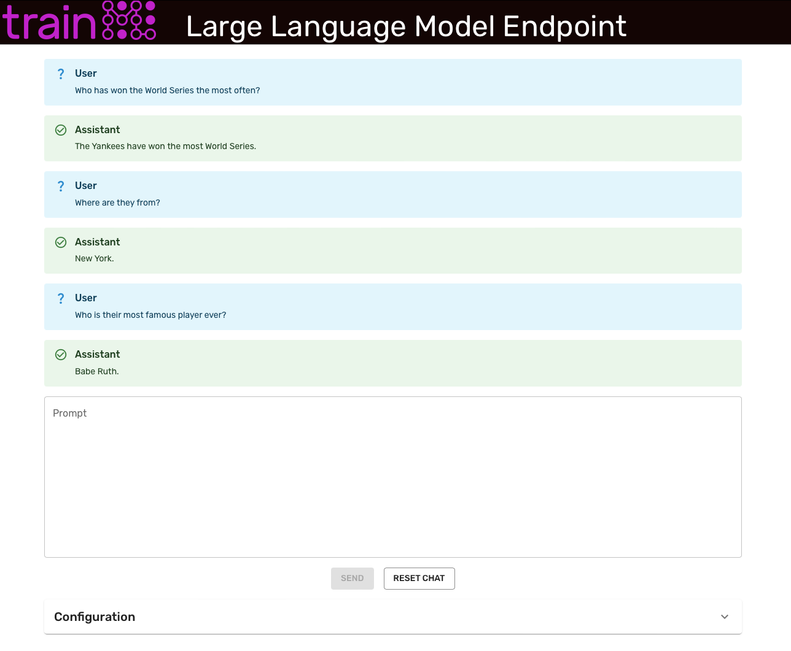

<div align="center">
  <a href="https://www.trainml.ai/"></a><br>
</div>

# Large Language Model Endpoint Example

This repository walks through how to use the [trainML platform](https://www.trainml.ai) to deploy a large language model for use in interactive chat tasks similar to [ChatGPT](https://platform.openai.com/docs/guides/chat). Running the default endpoint in the example as described will consume 0.98 credits ($0.98 USD) per hour of runtime.



### Prerequisites

Before beginning this example, ensure that you have satisfied the following prerequisites.

- A valid [trainML account](https://auth.trainml.ai/login?response_type=code&client_id=536hafr05s8qj3ihgf707on4aq&redirect_uri=https://app.trainml.ai/auth/callback) with a non-zero [credit balance](https://docs.trainml.ai/reference/billing-credits/)
- A python [virtual environment](https://docs.python.org/3/library/venv.html) with the [trainML CLI/SDK](https://github.com/trainML/trainml-cli) installed and [configured](https://docs.trainml.ai/reference/cli-sdk#authentication).

## Create the endpoint

trainML currently provides [Llama-2-7b-chat-hf](https://huggingface.co/meta-llama/Llama-2-7b-chat-hf), [
Llama-2-13b-chat-hf](https://huggingface.co/meta-llama/Llama-2-13b-chat-hf), and [falcon-7b-instruct](https://huggingface.co/tiiuae/falcon-7b-instruct) as [public checkpoints](https://docs.trainml.ai/reference/checkpoints#public-checkpoints) to attach to jobs for free.

> Note: Use of any Llama 2 checkpoint is governed by the Meta license. In order to use those checkpoints, you must visit their [website](https://ai.meta.com/resources/models-and-libraries/llama-downloads/) and accept their License.

To create a new endpoint using one of these checkpoints, run the following command in the base of this repository:

```
python deploy_endpoint.py --model=[Llama-2-7b-chat-hf,Llama-2-13b-chat-hf,falcon-7b-instruct]
```

> Both the Llama 7b and Falcon 7b can fit in a single GPU, to run the Llama 13b, use the `--gpu-count 2` option.

Once the endpoint is running, the script will output the endpoint URL.

## Launch the UI

Ensure the UI dependencies are installed by running `pip install -r requirements.txt`. Once that process completes, type `gradio front_end.py`. This print the local address the front end is running on (typically, http://127.0.0.1:7860). Copy and paste that address into a browser.

Enter the endpoint URL from the above section in the `API Endpoint` field and begin entering prompts. Expand the `Generation Parameters` section to experiment with different generation settings.

> Be sure to navigate to the [Endpoint Dashboard](https://app.trainml.ai/jobs/endpoint) to stop the endpoint when you are finished to avoid unexpected charges.
